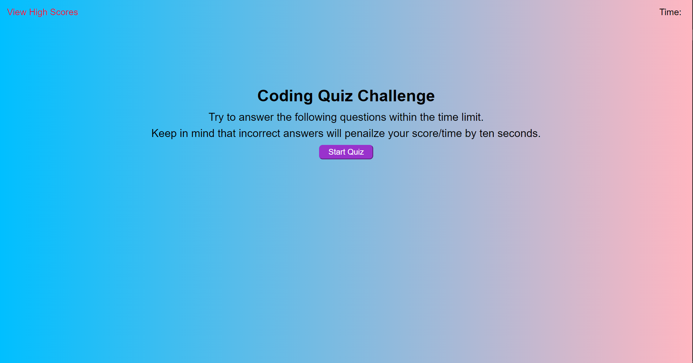
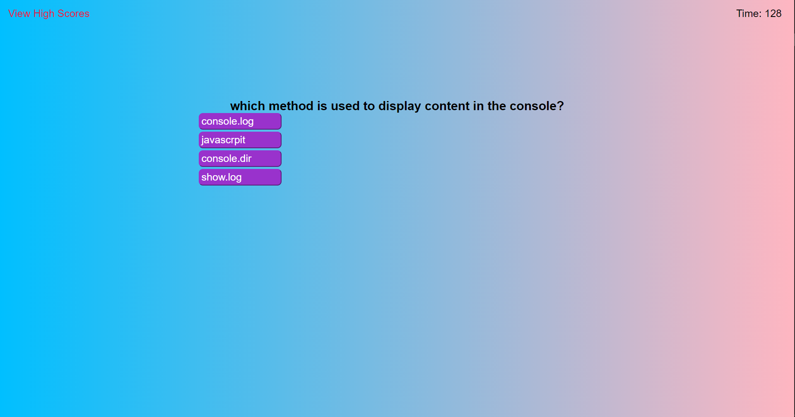
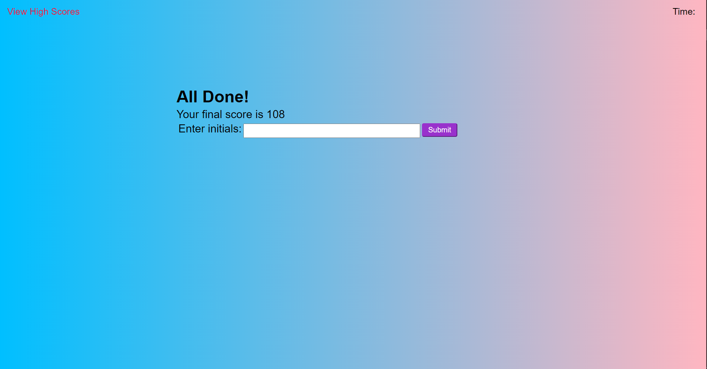
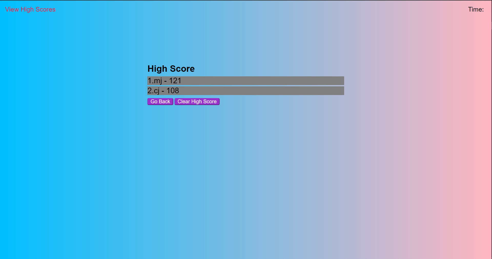

# # About The Project
## Description
This is a quiz about JavaScript

The website is an easy to use, easy to understand 5 questions quiz. It is a
multiple question using a timer as your score. It also has a highscore sheet as
well as a input for the highscore sheet. 
  It uses intiutize JavaScript to build sections of the page, eventlisteners
and logic to determine what to do and a timer that is displayed on the page
while taking the quiz. It is split in the four sections of the page the
starting/content page, the questions, the finished page, and the score page.

### Built with
* Html
* Css
* Javascript

## GitHub Page and repository
* [Github Page](https://mjbc53.github.io/code-quiz/)
* [Github Repo](https://github.com/mjbc53/code-quiz)

## Page screenshots

## Contact
* Email: mjbc53@gmail.com
* Github: [mjbc53](https://github.com/mjbc53)

